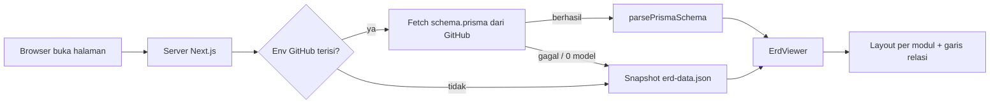

# Internal TemuDataku

Website internal TemuDataku untuk keperluan bisnis dan operasional tim.

Fitur yang tersedia saat ini adalah **ERD Viewer**: diagram relasi database
interaktif yang dibaca langsung dari `schema.prisma` di GitHub. Setiap kali
halaman dibuka, schema diambil ulang dan diparsing, jadi diagram selalu
mengikuti isi branch terbaru **tanpa perlu build atau deploy ulang**.

## Fitur

- **Data live dari GitHub.** Schema diambil dari `raw.githubusercontent.com`
  pada setiap kunjungan (tanpa cache). Tombol ↻ di sidebar mengambil ulang
  tanpa me-refresh halaman.
- **Snapshot cadangan.** Kalau GitHub tidak terjangkau, env belum diisi, atau
  file tidak ditemukan, halaman tetap tampil memakai snapshot bawaan
  (`erd-data.json`) dan memberi peringatan jelas bahwa datanya bukan live.
- **Dikelompokkan per modul.** Tabel diletakkan dalam kotak per modul
  (User & Role, E-Learning, Article, dst.), masing-masing dengan warna sendiri.
- **Pan dan zoom.** Scroll untuk zoom, drag untuk menggeser, tombol `+`, `-`,
  dan "Fit semua" di pojok kanan bawah.
- **Highlight relasi.** Klik sebuah tabel, maka garis relasi yang masuk dan
  keluar dari tabel itu menyala, sedangkan tabel dan garis lain diredupkan.
  Pilihan tetap bertahan saat kanvas di-drag. Klik area kosong untuk membatalkan.
- **Dokumentasi per tabel.** Klik sebuah tabel, maka panel dokumentasi terbuka di
  bawah kanvas: penjelasan fungsi tabel, penjelasan tiap kolom (tipe, constraint,
  default, contoh nilai), relasi PK/FK, dan catatan penting. Isinya dibaca dari
  `content/database-docs.md`. Nama tabel di dalam teks (mis. `users`) bisa diklik
  untuk lompat ke tabel itu. Panel bisa ditarik untuk mengubah tingginya, ditutup
  dengan tombol ✕ atau `Esc`. Tabel yang belum ada di dokumen tetap tampil dengan
  struktur dari schema.
- **Cari tabel dan filter modul** dari sidebar.
- **Tema terang dan gelap.** Pilihan disimpan di browser. Kunjungan pertama
  mengikuti pengaturan sistem.

## Teknologi

| | |
|---|---|
| Framework | [Next.js](https://nextjs.org) 16 (App Router) |
| UI | React 19, Tailwind CSS 4, CSS Modules untuk kanvas diagram |
| Bahasa | TypeScript |
| Sumber data | `schema.prisma` dari GitHub (di-parsing sendiri, tanpa Prisma Client) |

## Menjalankan di lokal

Prasyarat: **Node.js 20.9 atau lebih baru** (disarankan 22 LTS) dan npm.

```bash
# 1. Masuk ke folder frontend
cd frontend/internaltemudataku

# 2. Pasang dependensi
npm install

# 3. Buat file environment (lihat bagian berikutnya)
#    .env.local

# 4. Jalankan
npm run dev
```

Buka <http://localhost:3000>. Halaman yang sama juga tersedia di `/erd`.

Script lain:

```bash
npm run build   # build produksi
npm run start   # jalankan hasil build
npm run lint    # eslint
```

## Konfigurasi environment

Buat file `.env.local` di root project (sejajar `package.json`):

```env
GITHUB_OWNER=nama-user-atau-organisasi
GITHUB_REPO=nama-repo-backend
GITHUB_BRANCH=main
SCHEMA_PATH=prisma/schema.prisma
```

| Variabel | Wajib | Default | Keterangan |
|---|---|---|---|
| `GITHUB_OWNER` | ya | - | Pemilik repo di GitHub |
| `GITHUB_REPO` | ya | - | Nama repo yang berisi `schema.prisma` |
| `GITHUB_BRANCH` | tidak | `main` | Nama branch. Perhatikan, banyak repo memakai `master` |
| `SCHEMA_PATH` | tidak | `schema.prisma` | Lokasi file di dalam repo |

Cara mengisinya dari URL file di GitHub:

```
https://github.com/<GITHUB_OWNER>/<GITHUB_REPO>/blob/<GITHUB_BRANCH>/<SCHEMA_PATH>
```

Catatan penting:

- Repo yang berisi schema harus **public**, karena file diambil tanpa token.
  Kalau private, halaman otomatis jatuh ke snapshot cadangan.
- Next.js hanya membaca env saat start. Setelah mengubah `.env.local`,
  **restart** `npm run dev`.
- Jangan commit `.env.local` (sudah diabaikan oleh `.gitignore`).

## Cara kerja



1. `src/lib/erd/fetch-schema.ts` mengambil `schema.prisma` dan memanggil parser.
2. `src/lib/erd/parse-schema.ts` mengubah teks schema menjadi daftar tabel,
   kolom, primary key, dan foreign key.
3. `src/lib/erd/module-map.json` menentukan tiap tabel masuk modul mana.
4. `src/lib/erd/erd-engine.ts` menghitung posisi kotak modul, posisi tabel,
   dan jalur garis relasi.
5. `src/app/erd/ErdViewer.tsx` merender sidebar, kanvas, pan/zoom, dan highlight.

### Endpoint API

`GET /api/erd-data` mengembalikan data yang sama dengan yang dipakai halaman
(tanpa cache), berguna untuk tombol refresh dan pengecekan manual.

```jsonc
{
  "tables": [ /* TableDef[] */ ],
  "fetchedAt": "2026-10-08T03:21:00.000Z",
  "source": "github",        // atau "fallback"
  "sourceUrl": "https://raw.githubusercontent.com/...",
  "error": "..."             // hanya ada kalau source = "fallback"
}
```

Endpoint ini selalu membalas status 200. Cek field `source` dan `error`
untuk mengetahui apakah datanya live atau cadangan.

## Struktur folder

```
frontend/internaltemudataku/
├── src/
│   ├── app/
│   │   ├── layout.tsx            # layout root, metadata, script inisialisasi tema
│   │   ├── page.tsx              # halaman utama "/"
│   │   ├── globals.css           # token warna tema terang/gelap
│   │   ├── icon.svg              # favicon
│   │   ├── api/erd-data/route.ts   # endpoint JSON schema
│   │   ├── api/table-docs/route.ts # endpoint JSON dokumentasi tabel
│   │   └── erd/
│   │       ├── page.tsx          # halaman "/erd"
│   │       ├── ErdViewer.tsx     # komponen utama viewer
│   │       ├── DocPanel.tsx      # panel dokumentasi di bawah kanvas
│   │       ├── Markdown.tsx      # renderer markdown mini untuk isi dokumentasi
│   │       ├── ThemeToggle.tsx   # tombol tema
│   │       └── erd.module.css    # style kanvas, kotak tabel, garis relasi
│   └── lib/erd/
│       ├── fetch-schema.ts       # ambil schema dari GitHub + fallback
│       ├── parse-schema.ts       # parser schema.prisma
│       ├── parse-docs.ts         # parser content/database-docs.md
│       ├── load-docs.ts          # baca + cache dokumentasi (per waktu ubah file)
│       ├── erd-engine.ts         # layout + perhitungan garis relasi
│       ├── module-map.json       # pemetaan tabel -> modul
│       ├── erd-data.json         # snapshot cadangan
│       └── types.ts
├── content/
│   └── database-docs.md          # dokumentasi tiap tabel (sumber panel dokumentasi)
├── public/
├── next.config.ts
└── package.json
```

## Perawatan

### Menambah atau memindah tabel ke modul

Edit `src/lib/erd/module-map.json`. Kuncinya nama **tabel** (nilai `@@map`
di Prisma, bukan nama model):

```json
{
  "nama_tabel_baru": "E-Learning"
}
```

Tabel yang belum terdaftar masuk ke modul **Lainnya**. Untuk modul baru,
daftarkan juga warnanya di `MODULE_COLORS` pada `src/lib/erd/erd-engine.ts`
(tanpa itu modul memakai warna abu-abu).

### Memperbarui dokumentasi tabel

Edit (atau ganti) `content/database-docs.md`. File dibaca saat request dan
hanya di-parsing ulang kalau waktu ubahnya berubah, jadi **tidak perlu build
atau restart**; cukup klik tabel lagi atau tekan tombol ↻ di sidebar.

Parser mengenali format ini (sama dengan bagian "Cakupan & Cara Membaca Dokumen"
di file itu):

```md
### 5.15 `nama_tabel`            <- judul; opsional "(MASIH TIDAK DIPAKAI)" jadi badge
**Fungsi tabel**: ...            <- tab Ringkasan
#### Kolom                       <- tabel markdown -> tab Kolom
#### Primary Key & Foreign Key   <- tab Relasi
#### Relasi ke Tabel Lain ...    <- tab Relasi
#### 📌 Catatan ...              <- tab Catatan (boleh lebih dari satu)
---                              <- penutup dokumen satu tabel
```

Yang dicocokkan ke ERD adalah nama **tabel** di judul. Kalau judul memakai nama
lain dari tabel fisiknya, tambahkan alias di `TABLE_ALIASES` pada
`src/lib/erd/parse-docs.ts`. Lokasi file bisa diganti lewat env `DOCS_PATH`.
Kalau file hilang atau tidak terbaca, ERD tetap jalan dan panel menampilkan
pesan serta struktur kolom dari schema. Cek manual: `GET /api/table-docs`.

### Memperbarui snapshot cadangan

Snapshot (`erd-data.json`) hanya dipakai saat data live gagal diambil.
Supaya tidak ketinggalan jauh, perbarui sesekali. Jalankan `npm run dev`,
lalu di terminal lain:

```bash
node -e "fetch('http://localhost:3000/api/erd-data').then(r=>r.json()).then(d=>{if(d.source!=='github')throw new Error('Data bukan live: '+d.error);require('fs').writeFileSync('src/lib/erd/erd-data.json',JSON.stringify(d.tables,null,2))})"
```

Perintah ini menolak menimpa snapshot kalau datanya sendiri sedang cadangan.

### Mengubah warna tema

Semua warna ada di `src/app/globals.css` sebagai variabel `--erd-*`, satu blok
untuk tema gelap dan satu untuk tema terang. Ubah di sana, tidak perlu
menyentuh komponen.

## Deploy

Aplikasi ini **harus dijalankan sebagai server Node.js** (bukan hosting statis
atau static export), karena halaman memanggil `fetchLiveSchema()` di sisi server
pada setiap kunjungan.

Ringkasan untuk VPS (Ubuntu) dengan PM2 dan Nginx:

```bash
cd frontend/internaltemudataku
# buat .env.local berisi 4 variabel di atas
npm ci
npm run build
pm2 start npm --name erd -- start
pm2 save
```

Lalu arahkan Nginx (`proxy_pass http://127.0.0.1:3000`) dan pasang HTTPS
dengan certbot kalau sudah ada domain. Untuk memperbarui kode:

```bash
git pull && npm ci && npm run build && pm2 restart erd
```

Perubahan pada `schema.prisma` di repo backend **tidak** perlu langkah ini,
karena schema dibaca langsung setiap halaman dibuka.

Di platform lain (misalnya Vercel), isi keempat variabel environment di
pengaturan project, karena `.env.local` tidak ikut ter-deploy.

## Keamanan

Diagram ini menampilkan struktur database. Karena ini website internal:

- Jangan dibuka ke publik tanpa proteksi. Gunakan autentikasi (misalnya Basic
  Auth di Nginx, atau proteksi password bawaan platform hosting) dan HTTPS.
- Disarankan menambahkan `robots: { index: false, follow: false }` pada
  `metadata` agar halaman tidak diindeks mesin pencari. Itu hanya permintaan
  sopan ke crawler, bukan pengaman akses.

## Pemecahan masalah

| Gejala | Penyebab dan solusi |
|---|---|
| Kartu kuning "Data cadangan": *GITHUB_OWNER / GITHUB_REPO belum diset* | `.env.local` belum dibuat, salah lokasi, atau server belum di-restart |
| Pesan *404 -- cek lagi GITHUB_OWNER/...* | Salah satu dari owner, repo, branch, atau path keliru. Perhatikan `master` vs `main`. Repo private juga memberi 404 |
| Pesan *0 model ditemukan* | `SCHEMA_PATH` menunjuk ke file yang bukan `schema.prisma` |
| Tabel muncul di modul "Lainnya" | Belum ada di `module-map.json` |
| Ikon tab tidak berubah | Cache favicon browser. Hard refresh (`Ctrl+Shift+R`) atau buka di tab incognito. Pastikan filenya bernama `src/app/icon.svg` |
| Error TypeScript `Cannot find name 'LayoutProps'` | Tipe ini dibuat otomatis oleh Next.js. Jalankan `npm run dev`, `npm run build`, atau `npx next typegen` sekali |
| Build gagal mengambil font Google | Server build butuh akses internet ke `fonts.googleapis.com` |